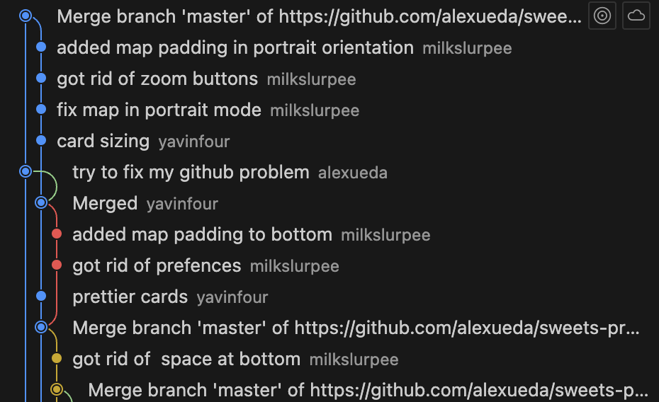
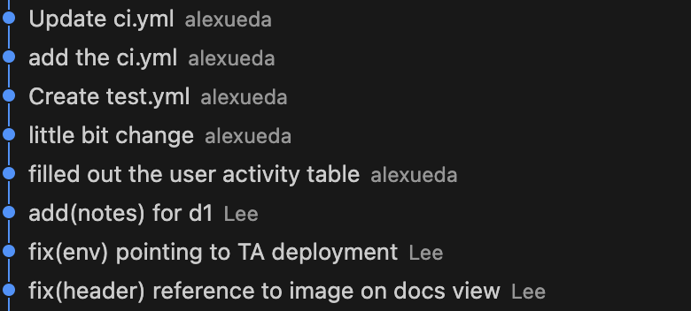

# Curiosity Report: Git Branching Strategy and Forking in Collaboration

## Introduction

In my journey through software development courses and team-based projects, I’ve often faced challenges when collaborating with others using GitHub. One of the biggest pain points has been **merge conflicts**, especially when multiple team members work directly on the `main` branch or forget to sync changes before pushing.

At first, we thought the easiest way to collaborate was to simply **add all teammates as collaborators** on a single GitHub repository. This gave everyone permission to push directly to `main`. While convenient, this often led to problems—**overwritten work, frequent merge conflicts, and confusion about which changes were most up to date**.

To illustrate this, here’s a **bad example** of what our workflow looked like:



In this situation, all team members are pushing changes to the same branch, sometimes editing the same files at the same time, without coordination.

In this class, we learned to use a much better approach—**each person forks the main repository and creates their own feature branches**. This new process helped us stay organized, isolate our work, and merge changes more safely using pull requests.

Here’s a **good example** of the improved workflow:



Each teammate now works in their own forked repository, creates branches and opens a pull request back to the main repo. This allows for code review, discussion, and automated testing before merging into the `main` branch.

These experiences made me curious to understand **why branching strategies matter** and how professionals structure their Git workflows. This report explores the purpose of Git branching, the different types of branches used in real-world software engineering, and how branching strategies support collaboration, quality assurance, and DevOps best practices.


## The Power of Forking

Forking is a powerful GitHub feature that allows a developer to create a personal copy of someone else’s repository. When working on collaborative or open-source projects, **forking helps developers contribute without having direct write access to the original repository**.

### Why Use Forks?

- Prevents direct conflicts on the main repository.
- Maintains a clean separation between contributor and project owner.
- Enables external contributors (even strangers) to suggest improvements via pull requests.
- Allows testing and experimentation without affecting the upstream codebase.

### How Forking Works in a Team

1. **Each developer forks the main repository** to their personal GitHub account.
2. They clone their fork locally and create a new feature or bugfix branch.
3. After making changes, they push to their fork and open a pull request to the main repository.
4. Project maintainers review the pull request, request changes if needed, and then merge it into the main codebase.

This model is widely used in open source and by professional teams, especially in **microservices**, **inner source development**, and **DevOps pipelines**.


## Real-World GitHub Workflow

In a professional development setting, branching and forking go hand in hand. Here’s how a structured workflow typically looks:

### 1. Fork the Main Repository

Visit the GitHub repository you want to contribute to and click **"Fork"** in the top right.

```bash
# Clone your fork locally
git clone https://github.com/your-username/project-name.git
cd project-name
```

### 2. Create a Branch for Your Work

Always create a new branch for your feature or fix to keep things isolated and organized.

```bash
git checkout -b feat-login-page
```

### 3. Make Changes and Push to Your Fork

After editing your code and committing locally:

```bash
git add .
git commit -m "Add login page"
git push origin feat-login-page
```

### 4. Open a Pull Request

Go to your fork on GitHub and click "Compare & pull request". This allows the main repo maintainers to review your changes before merging.


### 5. Syncing Your Fork (Optional but Important)

Over time, the main repo may update. You can sync your fork using the upstream remote:

```bash
git remote add upstream https://github.com/original-owner/project-name.git
# Fetch changes
git fetch upstream
# Merge into your local branch
git merge upstream/main
```
This keeps your fork up to date with the latest codebase.


## Types of Branches

Professional development teams organize their work by using different types of branches to handle various aspects of the development lifecycle. Here are the most common types:

### Main Branches
- **Master/Main:** This branch holds production-ready code. It should only receive merges from release or hotfix branches.
- **Develop:** The active development branch where all feature and bugfix branches eventually merge. It reflects the latest state of ongoing development.

### Supporting Branches
- **Feature Branches:** Created off `develop` for developing new features or enhancements.  
  - **Naming Convention:** `feat-issue-<id>`  
  - **Usage:** Work on a specific feature, merge back into `develop` when complete.
  
- **Bugfix Branches:** Similar to feature branches but focused on fixing issues.  
  - **Naming Convention:** `bug-issue-<id>`  
  - **Usage:** Isolate and fix bugs, then merge back into `develop`.
  
- **Hotfix Branches:** Created off `master` to address urgent issues in production.  
  - **Naming Convention:** `hotfix-issue-<id>`  
  - **Usage:** Fix critical issues quickly, then merge back into both `master` and `develop`.
  
- **Release Branches:** Used to finalize a new release. They branch off from `develop` and are merged into both `master` (for production release) and `develop` (to incorporate final changes).  
  - **Naming Convention:** `release-<version>`  
  - **Usage:** Prepare for release with final testing, bug fixes, and documentation updates.

Using these branches helps teams isolate work, facilitate code review, and maintain high-quality production code.


## Benefits of Fork + Branch Model

| Benefit           | Description                                                                  |
|-------------------|------------------------------------------------------------------------------|
| Isolation         | Contributors work independently, minimizing conflict.                      |
| Controlled Merges | All changes go through pull requests and code review.                        |
| Security          | Maintainers don't have to give write access to everyone.                     |
| Traceability      | Every change is linked to a specific branch and contributor.                 |
| Scalability       | Works well for both small class projects and large open-source efforts.      |


## How It Connects to DevOps and QA

- **CI/CD Integration:** Most teams use GitHub Actions or Jenkins to run tests on every pull request.
- **Review Process:** Pull requests allow senior developers or QA engineers to verify changes before merging.
- **Safe Deployments:** Feature flags and release branches can be integrated for phased rollouts.

Professional teams at companies like GitHub, Microsoft, and Netflix follow this kind of flow, combining forking, branching, and pull requests into automated pipelines that ensure code quality and smooth deployments.


## Conclusion

Through hands-on experience in this class and additional research, I now understand the importance of branching and forking in managing collaborative development. Initially, we encountered many problems because everyone was pushing to the same branch. However, once we started using forks in another class project and adopted structured branching strategies, our teamwork improved significantly.

This model isn't just for CS329—it's exactly how many real-world software developers manage professional projects. They use forks to isolate contributors, branches to organize work, and pull requests to ensure quality and confidently merge changes.

Understanding this process has made me more confident in my ability to contribute to larger codebases and collaborate effectively in both academic and professional environments.
