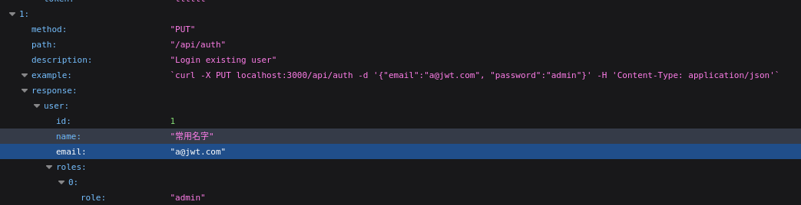
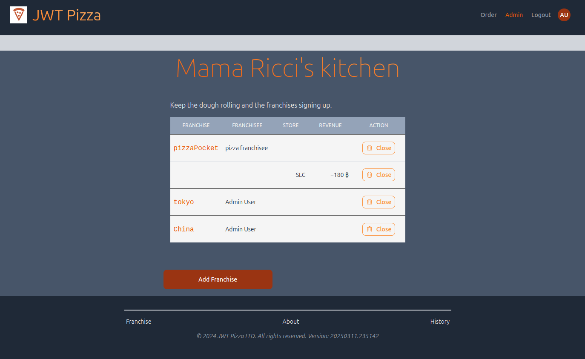
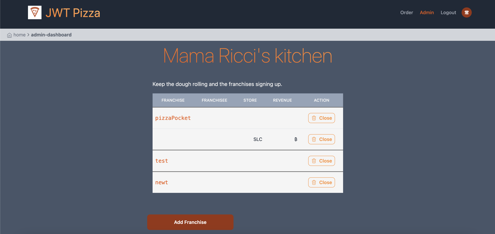
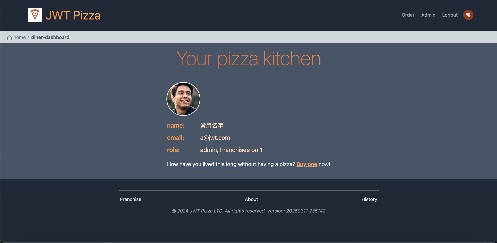
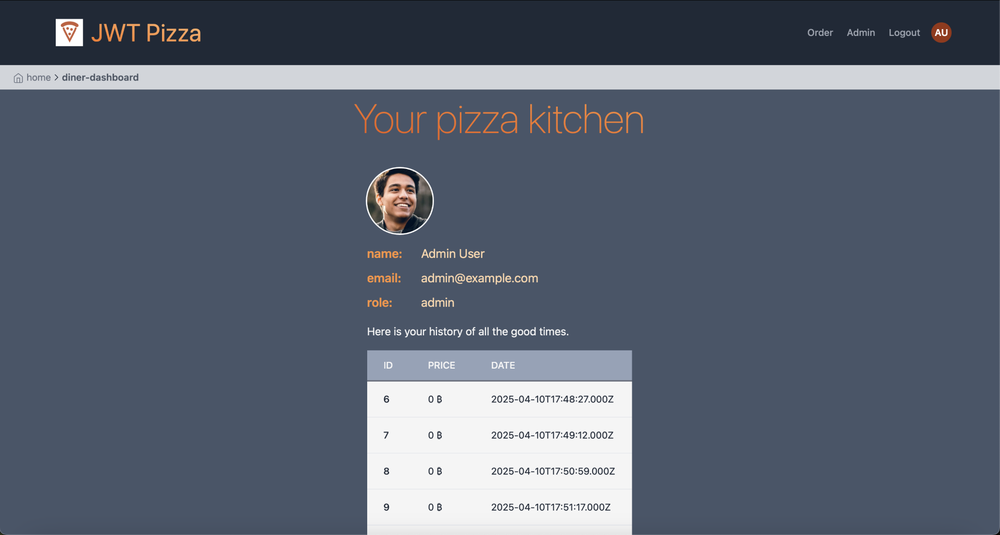

## Alexander Ueda and James Phelps Penetration Test Report 

## Self Attacks
### James
Attack 1
| Item           | Result                                                                         |
| -------------- | ------------------------------------------------------------------------------ |
| Date           | April 9, 2025                                                                  |
| Target         | https://pizza.jamesephelps.com                                                      |
| Classification | Injection / Insecure Design                                                                |
| Severity       | 1                                                                              |
| Description    | Could write a script to iterate through the user id's since they are assigned in numerical order. Could potentially delete all usernames/passwords through the PUT auth endpoint if gained admin access.                 |
| Corrections    | Change how user ID's are assigned                                                         |

Attack 2

| Item           | Result                                                                         |
| -------------- | ------------------------------------------------------------------------------ |
| Date           | June 18, 2025                                                                  |
| Target         | https://pizza.jamesephelps.com                                                                |
| Classification | Insecure Design                                                               |
| Severity       | 1                                                                              |
| Description    | Can login with normal admin credentials and make changes.   |
| Corrections    | Change admin username and password.  

### Alexander
Attack 1
| Item           | Result                                                                         |
| -------------- | ------------------------------------------------------------------------------ |
| Date           | June 18, 2025                                                                  |
| Target         | https://pizza-service.sharenote.link/                                                                  |
| Classification | Insecure Design                                                               |
| Severity       | 1                                                                              |
| Description    | Can login with normal admin credentials and make changes.   |
| Corrections    | Change admin username and password.  
                  
## Peer Attacks
### James 
Attack 1

| Item           | Result                                                                         |
| -------------- | ------------------------------------------------------------------------------ |
| Date           | June 18, 2025                                                                  |
| Target         | https://pizza-service.sharenote.link/                                                                  |
| Classification | Insecure Design                                                               |
| Severity       | 1                                                                              |
| Description    | Admin login was available through /api/docs. Could log in and make any changes desired. All endpoints compromised.       |
| Images         |   |
| Corrections    | Change admin username and password.  
                                                         |
Attack 2
| Item           | Result                                                                         |
| -------------- | ------------------------------------------------------------------------------ |
| Date           | April 10, 2025                                                                  |
| Target         | https://pizza-service.sharenote.link/                                                       |
| Classification | Insecure Design | Failures                                                                    |
| Severity       | 2                                                                             |
| Description    | Can modify order requests to change the price of pizza. Can do little prices or even negative.  |
| Images         |   |
| Corrections    | Don't use user requests to determine pizza prices. 

### Alexander
Attack 1

| Item           | Result                                                                         |
| -------------- | ------------------------------------------------------------------------------ |
| Date           | April 10, 2025                                                                  |
| Target         | https://pizza.jamesephelps.com                                                       |
| Classification | Identification and Authentication Failures                                                                    |
| Severity       | 3                                                                              |
| Description    | Cached old admin information from a few days ago and was able to get the new franchisee information after that admin had been deleted   |
| Images         |    |
| Corrections    | Fix authentication token to not persist forever.  

Attack 2

| Item           | Result                                                                         |
| -------------- | ------------------------------------------------------------------------------ |
| Date           | April 10, 2025                                                                  |
| Target         | https://pizza.jamesephelps.com                                                       |
| Classification | Identification and Authentication Failures                                                                    |
| Severity       | 1                                                                             |
| Description    | Was able to brute force the password using the top 100 password list because the password was sneakily changed to 'password.' Had full admin access and could delete the stores and make new ones.  |
| Images         |   |
| Corrections    | Don't choose stupid passwords. 

                                    

## Combined Summary of Learnings
  In the course of conducting these penetration tests we learned a lot about the many different opportunities there are for vulnerabilities. It seems at every step there is some way to inadvertently make our web app insecure. Our app seemed to be secure for the most part, but then there were things that went wrong after you got through the first few layers of security. For example, after signing in and feeling like it is secure, you can still edit the requests to change the price of the pizza. By that point it just felt like the roles and user stuff was correct, but there was still somehow this glaring vulnerability.

  The most suprising issue we found was when Alex pulled up James's website and was signed in with the admin account that James had intentionally removed beforehand. Because the token was still in Alex's browser, he was still able to request the information about the different franchisees even though that admin account had long since been deleted. He couldn't do anything crazy with it because most actions failed to authenticate, but it was still a problem because it could still request some information that it shouldn't have been able to.

  James spent most of his self-attack time trying to engineer an SQL injection, but failed to do so for two different reasons. Either the database functions that had direct user input in them were parameterized decently or they drew information from the URL params, which would be reverted to NaN by Express if any additional characters were added.

  In the end, we saw some of the natural security protections that our tech stack provides- be they intentional or unintentional. More importantly, we also saw the significance of designing our systems well to avoid creating vulnerabilities. There are just a ton of ways to screw things up and leak information or priveleges.
